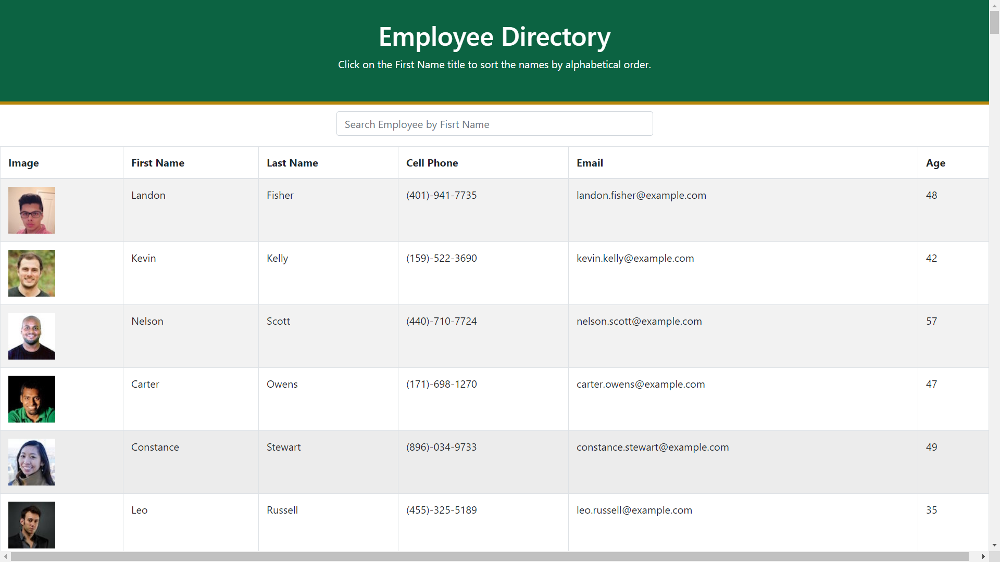

# Employee Managament Directory

## Description
As a developer I created an employee directory with React library, the app will allow users to view the entire employee directory at once in a table with all of the employees information. Also the app will let users filter employees by name. The application's UI is divided into components, manage component state, and respond to user events.  

This project was bootstrapped with [Create React App](https://github.com/facebook/create-react-app).

## Available Scripts

In the project directory, you can run:

### `npm start`

Runs the app in the development mode.<br />
Open [http://localhost:3000](http://localhost:3000) to view it in the browser.

The page will reload if you make edits.<br />
You will also see any lint errors in the console.
 
## Screenshot 


## Directory structure
```
.
├── build
|
├── node_modules
│ 
├── public
│
├── src
│    ├── components
│    │       ├── Header
│    │       ├── SearchForm
│    │       ├── SearchResultContainer
│    │       └── Table
│    │   
│    ├── styles
│    │      ├── Header
│    │      ├── SearchForm
│    │      └── Table
│    │
│    └── utils
│          └── API.js
│          
├── package.json
│
└── README.md   
```

## Links to deployed app
https://eradicador.github.io/employee-app/.

https://github.com/eradicador/employee-app


## Badge


## License

MIT License

Copyright (c) [2020] [Michael Amaya]

Permission is hereby granted, free of charge, to any person obtaining a copy
of this software and associated documentation files (the "Software"), to deal
in the Software without restriction, including without limitation the rights
to use, copy, modify, merge, publish, distribute, sublicense, and/or sell
copies of the Software, and to permit persons to whom the Software is
furnished to do so, subject to the following conditions:

The above copyright notice and this permission notice shall be included in all
copies or substantial portions of the Software.

THE SOFTWARE IS PROVIDED "AS IS", WITHOUT WARRANTY OF ANY KIND, EXPRESS OR
IMPLIED, INCLUDING BUT NOT LIMITED TO THE WARRANTIES OF MERCHANTABILITY,
FITNESS FOR A PARTICULAR PURPOSE AND NONINFRINGEMENT. IN NO EVENT SHALL THE
AUTHORS OR COPYRIGHT HOLDERS BE LIABLE FOR ANY CLAIM, DAMAGES OR OTHER
LIABILITY, WHETHER IN AN ACTION OF CONTRACT, TORT OR OTHERWISE, ARISING FROM,
OUT OF OR IN CONNECTION WITH THE SOFTWARE OR THE USE OR OTHER DEALINGS IN THE
SOFTWARE.

## Contributing
[](code_of_conduct.md)


